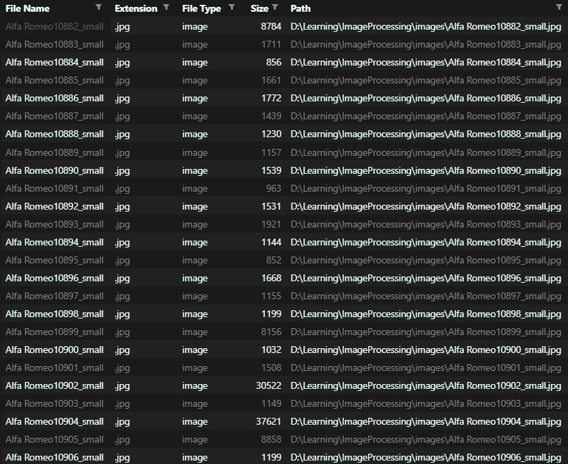

# DSMkr
##### Dataset Maker

A tinyApp simply made to make your life easier.
Don't you find it to be a needless pain having to make a dataset for your data manipulation needs?<br>

Well, good news. You don't have to struggle that much anymore, all you have to do now is to provide the path to where your images/files are located and the Dataset Maker does the rest of the work for you.

As of right now, the dataset maker identifies the following filetypes, feel free to make a pull request to contribute to extending the file types for the dataset maker.

- [x] JPG, PNG
- [x] TXT, MD, HTML
- [x] MP3, MP4
- [x] CSS, SCSS
- [x] EXE
- [x] Java, Python, C, C++, JS

## Execution of the program
Below is the execution of the program, in the command prompt.
```
D:\tinyApps\dataset-maker>python dataset_maker.py
Enter the path to the directory: D:\Learning\ImageProcessing\images
Enter the path to extract the csv to: D:\tinyApps\dataset-maker
Enter the name of the csv file( without extension ): trial_images
Indexing...
Folder:  D:\Learning\ImageProcessing\images
Output Path:  D:\tinyApps\dataset-maker
File Name:  trial_images.csv
Directories present in the folder are :  []
``` 

As you can see, the only input required from the user is the folder path, output path, and the name of the ```.csv``` file they wish to create.

The program shows you the directories present in the folder as well after the execution, of the program in the command prompt.

## Output CSV

<a align="center">
    
</a>
